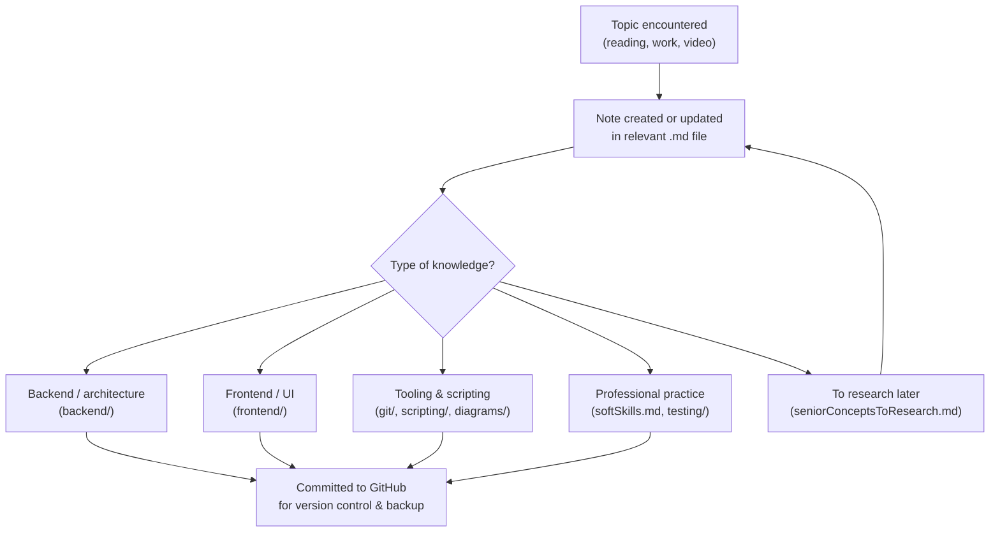

# code


## Overview

Keeping useful engineering knowledge scattered across browser tabs, chat histories, and ad-hoc text files makes it hard to find and reuse later. This repository is a personal second-brain for software engineering notes — covering backend architecture, frontend patterns, tooling, and professional practice — maintained as structured Markdown files. It is intended for the author's own reference and revision, and is equally useful as a browsable example of how to organise self-directed technical learning.

## Structure

```sh
code/
├── backend/                        # 🖥️  Server-side concepts
│   ├── circuitBreakers.md          # Circuit breaker pattern with Resilience4j examples
│   ├── kafka.md                    # Kafka brokers, topics, partitions, and consumer groups
│   ├── restApi.md                  # REST API design best practices (Microsoft guidance)
│   └── swift/
│       ├── swift.md                # Swift & SwiftUI notes (views, state, navigation, testing)
│       └── xcode.md                # Xcode troubleshooting tips
├── diagrams/
│   └── plantUml.md                 # PlantUML syntax examples (sequence, activity, class)
├── frontend/
│   └── javascript.md               # JavaScript, React, TypeScript, Material UI, Formik
├── git/
│   ├── git.md                      # Git core concepts and command cheat sheet
│   └── git cli.md                  # GitHub CLI (gh) command reference
├── scripting/
│   ├── NeoVim.md                   # NeoVim setup, plugins (Telescope, neo-tree, lazygit)
│   ├── dotfiles.md                 # Dotfiles strategy using symbolic links
│   └── vi.md                       # Vi/Vim command cheat sheet
├── testing/
│   └── testing.md                  # TDD principles and types of testing
├── zettlekasten/
│   └── dotfiles.md                 # Zettelkasten-style note on dotfiles purpose
├── docker.md                       # Docker images, containers, volumes, Compose
├── linuxCommands.md                # macOS/Linux shell command reference (Homebrew)
├── seniorConceptsToResearch.md     # 📋 Backlog of senior engineering topics to explore
└── softSkills.md                   # Professional practice notes (inspired by Clean Coder)
```

## How It Works



## References

- [Resilience4j Circuit Breaker docs](https://resilience4j.readme.io/docs/circuitbreaker)
- [Microsoft REST API design best practices](https://learn.microsoft.com/en-us/azure/architecture/best-practices/api-design)
- [PlantUML documentation](https://plantuml.com)
- [GitHub CLI documentation](https://cli.github.com)
- [LazyVim starter configuration](https://github.com/LazyVim/starter)
- [Harvey-Mackie/dotfiles](https://github.com/Harvey-Mackie/dotfiles) — companion dotfiles repository
- [dotfiles.github.io](https://dotfiles.github.io) — community dotfiles guidance
- [Clean Coder by Robert C. Martin](https://www.oreilly.com/library/view/the-clean-coder/9780132542913/) — inspiration for `softSkills.md`
